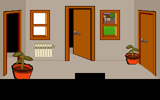

# The Adventures Of Firulais & Calcetines (With Trufa and Miki)

A simple, short proof of concept to test [AGS (Adventure Game Studio)](https://www.adventuregamestudio.co.uk). The
plot is very simple: some cats live in a house, and they have to do things, just like the old "point and click" games. I get the look and feel of Lucasarts' Games (e.g. [Monkey Island](https://es.wikipedia.org/wiki/The_Secret_of_Monkey_Island), [Maniac Mansion](https://en.wikipedia.org/wiki/Maniac_Mansion)) with some improvements of [Thimbleweed Park](https://en.wikipedia.org/wiki/Thimbleweed_Park) the last game written by **Ron Gilbert** and **David Fox**.


This project uses [AGS (Adventure Game Studio)](https://www.adventuregamestudio.co.uk) as development framework. AGS has two parts, the **engine** that runs on Windows, MacOS, Linux, PSP (among others) and the **editor** that sadly, only runs on Windows, but they are trying to refactor all the code and do it more portable. I use the latest version available, **3.5.0**.

In order to implement the LucasArt's interface, I modify the [TumbleWeed Vers](https://github.com/dkrey/ags_tumbleweed) template from **drkey**. These template provides the basics of a 9-verb interface, just like the latest Thimbleweed Park or The Day of The Tentacle.

**NOTES**:

* The game is designed in the old-but-good **320x200** mode. 
* Graphics are somewhat crap, but I'm not graphic designer. 
* English translation ... well, you know; english level: medium.
* Sounds are picked from internet.
* Assets included.

# Table Of Contents

1. [Project Features](#project-features)
2. [Download](#download)
3. [Instructions](#instructions)
4. [Python room generator](#python-room-generator)

# Project features

The "main" features of this game are:

1. Support for 9-verb interface, fully localized, with button adaptation to the locale. See [issues](https://github.com/dkrey/ags_tumbleweed/issues?q=is%3Aopen+is%3Aissue) for more detailed info about that.
2. Support up to for players (cats) at the same time, just like Thimbleweed park, Maniac Mansion or The Day Of the Tentacle. I modify the template and write some custom code to provide a new interface with keyboard shorcuts.
3. Python-Based semi-procedural room generation. **See below** (that's interesting).
4. Test all the major aspects of this kind of game development:
    1. Multiple rooms and navigation.
    2. Open/Close/Locked doors.
    3. Multiple-Level dialogs (with code inside).
    4. Overhead map.
    5. Multiple player coordination.
    6. Inventory Management.
    7. "Sound". (I pick some random noises from the internet to test it).
    8. Cutscenes (intro, ending).
    9. Custom text render.
   10. The pain-in-the-ass of drawing graphics.
   11. Animations.
   12. Localization (currently only english and spanish)


# [Download](#download)

The AGS engine runs on **Android, iOS, Linux, Mac OS X, PSP and Windows**. See their [github page](https://github.com/JanetGilbert/ags) for instructions and building. The engine is used to run the game. So if you plan to run this game on that platforms, take a read. 

On **Windows** and **Linux** is pretty straighforward: go to the [Releases Page](https://github.com/juanmcasillas/CatVentures/releases), download the latest binary, and try it, quick, and dirty. In other platforms, you need the engine compiled.

# [Instructions](#instructions)

Just click in the verbs and interact with the objects and characters in the screen :-).

## Active Regions

There are two active regions: 
1 *settings*: move the mouse cursor to the **top-right** corner and press the gear button.
2 *catmenu*: move the mouse cursor to the **top-left** corner and press in the desired cat. If the cat is not available, it's gray and/or not shown  (e.g. when you starts, only firulais is shown).

## Keyboard shorcuts

<br/>

|Action                                          |Key      |
|------------------------------------------------|--------:|
| Take Screenshot | F12 or |
| Options         | F5  |
| Quit            | Ctrl-C or Ctrl-Q |
| ESC             | Skip intro and dialogs |
| Cat 1 (Firulais)   | 1 |
| Cat 2 (Calcetines) | 2 |
| Cat 3 (Miki)       | 3 |
| Cat 4 (Trufa)      | 4 |
|||
| Open   | q |
| Close  | a |
| Give   | z |
|||
| Pick up | w (in spanish this is Push) |
| Look at | s |
| Talk To | x |
|||
| Push  | e (in spanish this is pick up) |
| Pull  | d |
| Use   | c |
|||
| Mouse wheel     | scrolls the dialogs |
| Left button     | primary action (e.g. walk) |
| Right button    | secondary action (e.g. take) |
|||
| Double click on doors | exit automatically |
| Double click on floor | walks quickly |

<br/>
<br/>

## Savegames & screenshots

On Windows, Saved Games and Screenshots are stored on directory: **`%USERPROFILE%/Saved Games/CatVentures`**

* Savegames: `agssave.nnn` where `nnn` is a number (e.g `agssave.001`)
* Screenshots: `screenshot_<date>-<time>-<counter>.bmp` (e.g. `screenshot_11102019-094506-0001.bmp`)

I didn't test in other platforms. Tell me about it.

# Python Room Generator

This nifty tool builds "rooms" in a semi procedural way, reading the room info from an XML file ([GraphML](https://en.wikipedia.org/wiki/GraphML)) that can be visualized by any tool (e.g [yEd](https://www.yworks.com/products/yed#yed-support-resources)). The XML parser uses [untangle](https://untangle.readthedocs.io/en/latest/) a decent and fast XML->Obj tool.

The following node definition creates a room with four doors, two windows and two plants and a radiator. Firulais
appears in this room. For now, character positioning is not enabled. Note that windows can have background or not.



```xml
    <node id="room_01">
      <data key="name">Main Hall</data>
      <data key="desc">When the game starts</data>
      <data key="id">1</data>
      <data key="type">normal</data>

      <data key="chars">
        <char id="Firulais" state="normal"></char>
      </data>
      
      <data key="doors">
        <door id="1" position="left" type="FullOpen"/>
        <door id="2" position="right" type="Closed"/>
        <door id="3" position="front" type="Open" xpos="130" ypos="12" />
        <door id="4" position="bottom" type="Closed" xpos="150" ypos="146" />
      </data>

      <data key="windows">
        <window id="1" type="small" position="front" xpos="60" ypos="20"/>
        <window id="2" type="small" position="front" xpos="200" ypos="20" bg="true" hotspot="true"/>
      </data>

      <data key="objects">
        <object type="plantbig" id="1" xpos="20" ypos="100" hotspot="false" behind="true"/>
        <object type="plant" id="1" xpos="250" ypos="90"/>
        <object type="radiator" id="2" xpos="60" ypos="85" hotspot="true"/>
      </data>
    
    </node>
```

Relation between rooms can be defined as nodes, but currently, are not used.

```xml
    <edge id="1:1:2" source="room_01" target="room_02"/>
    <edge id="1:3:3" source="room_01" target="room_03"/>
```

For each room, it also creates automatically some masks. These masks are created as indexed color `PNG` file, so each color means one object (e.g. (color 0 (background) means on use on AGS) color 1 is one element, color 2 another one, and so on). These are the masks:


*Walk* layer to indicate the zones when the character is allowed to walk.


*Behinds* layer that indicates when the player is hiding *behind* the object (see the plant in first plane)


*Hotspots* interesting places (e.g. windows, exits, interactive elements)


*Regions* Special zones when things happens (currently empty)

The script also build a multi-layered **PSD** file, to ease the work for the graphics designer.


Also supports long rooms, big windows (with and without background and lateral positioning) and some things, 
like plants, pictures and radiators. You can extend your objects easily from the python class, for example,
the picture object:

```python
class PictureAlley(BaseObject):
    def __init__(self, coords, behind=False, hotspot=False):
        super().__init__(coords,behind,hotspot)
        self.res = {
            "img": os.path.join(self.basedir, "pictures/picture_alley.png"),
            "hotspot": os.path.join(self.basedir, "pictures/picture_alley_hotspot.png"),
        }
        self.name = "PictureAlley"
```

# LICENSES

TrueType font display uses ALFont by Javier Gonzalez and the Freetype project. Distributed under the terms of the FreeType project license.

OGG player is alogg by Javier Gonzalez, using the Ogg Vorbis decoder, which is available from http://www.xiph.org/ Copyright (c) 2002, Xiph.org Foundation

MP3 player is almp3, by Javier Gonzalez and the FreeAmp team. It uses the mpg123 MP3 decoder, and is distributed under the terms of the GNU Lesser General Public License version 2.1.

